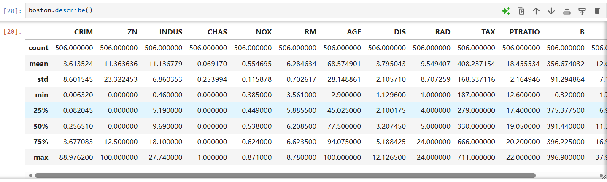

Pandas[用于数据读取、清洗、分析的工具库]

DataFrame[数据结构，一个二维表格]

sep = ","  1,2,3 表示分隔符
## df.info()
### 作用
查看 DataFrame 的基本结构。

### 它能告诉我什么？
- 有多少行、多少列
- 每一列的名字
- 每一列有没有缺失值
- 每一列的数据类型，比如 float64、int64、object

### 在波士顿房价任务里的作用
我可以用它检查数据是否成功读入，以及每个特征是否都是数字类型。

### 我的理解
它就像是在训练模型前，先看一眼数据的“体检报告”。

## df.describe()

### 作用

`df.describe()` 用来查看 DataFrame 中数值型数据的统计信息。

它可以帮助我们快速了解数据的大致分布情况，比如平均值、最大值、最小值、数据波动范围等。

### 常见输出含义

| 指标 | 含义 | 我的理解 |
|---|---|---|
| count | 非空数据的数量 | 这一列有多少个有效数据 |
| mean | 平均值 | 这一列数据的大致平均水平 |
| std | 标准差 | 数据波动大不大 |
| min | 最小值 | 这一列里面最小的数据 |
| 25% | 下四分位数 | 有 25% 的数据小于这个值 |
| 50% | 中位数 | 一半数据小于它，一半数据大于它 |
| 75% | 上四分位数 | 有 75% 的数据小于这个值 |
| max | 最大值 | 这一列里面最大的数据 |

## df.corr()

### 作用
计算不同变量之间的相关性，结果范围是 -1 到 1。

### 怎么理解？
- 接近 1：两个变量正相关，一个变大，另一个也容易变大
- 接近 -1：两个变量负相关，一个变大，另一个容易变小
- 接近 0：关系不明显

### 在房价预测中的作用
可以用它观察哪些特征和房价 MEDV 关系比较强。

例如：
- RM 和 MEDV 正相关，说明房间数越多，房价通常越高
- LSTAT 和 MEDV 负相关，说明低收入人口比例越高，房价通常越低

### 我的理解
相关性不是因果关系，但它可以帮助我初步判断哪些特征可能比较重要，以及与目标变量之间的关系影响

**Boston房价预测任务**：根据房屋特征预测房价

**[目标变量]** MEDV

**[类型]** 回归问题

**[使用模型]** LinearRegression(线性回归模型)

# 线性回归和逻辑回归的区别

| 对比点 | 线性回归 | 逻辑回归 |
|---|---|---|
| 解决问题 | 回归问题 | 分类问题 |
| 输出结果 | 连续数值 | 概率 |
| 输出范围 | 任意实数 | 0 到 1 |
| 常见例子 | 预测房价 | 判断是否为某一类 |
| 模型形式 | hθ(x)=θᵀx | hθ(x)=sigmoid(θᵀx) |
| 常用损失函数 | 均方误差 MSE | 交叉熵损失 |
| 判断方式 | 直接看预测值 | 根据概率和阈值分类 |

## 我的理解

线性回归像是在预测一个具体数字，比如房价是多少。

逻辑回归像是在判断一件事发生的概率，比如是不是垃圾邮件、是不是猫、是否会通过考试。

线性回归的输出可以很大也可以很小。  
逻辑回归的输出会被 Sigmoid 函数限制在 0 到 1 之间，所以可以当成概率来理解。